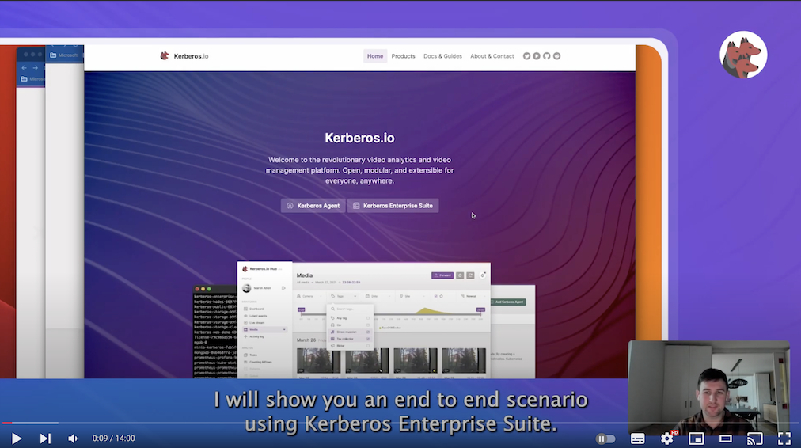

## Welcome to Kerberos.io 👋

Kerberos.io scalable video analytics and video management platform, build on top of Docker and Kubernetes, for everyone and everywhere.

Kerberos.io comes with a range of tools allowing you to start small - home deployment, with a few cameras - and scale out to a large - enterprise deployment, with thousands of cameras.

The Kerberos.io suite contains following products:

- [Kerberos Agent](https://github.com/kerberos-io/agent)
- [Kerberos Factory](https://github.com/kerberos-io/factory)
- [Kerberos Vault](https://github.com/kerberos-io/vault)
- [Kerberos Hub](https://github.com/kerberos-io/hub)
